# Pipeline-Documentation

# Pipeline

## Table of Contents

- [Pipeline-Documentation](#pipeline-documentation)
- [Pipeline](#pipeline)
  - [Table of Contents](#table-of-contents)
  - [DevOps CI/CD \& Jenkins Notes](#devops-cicd--jenkins-notes)
- [Software Development Life Cycle (SDLC)](#software-development-life-cycle-sdlc)
  - [Stages of SDLC](#stages-of-sdlc)
- [CI/CD Pipeline Overview](#cicd-pipeline-overview)
- [Tools used in CI/CD](#tools-used-in-cicd)
  - [Jenkins](#jenkins)
  - [Jenkins Architecture](#jenkins-architecture)
- [1. Master Node](#1-master-node)
- [2. Agent Nodes (Workers)](#2-agent-nodes-workers)
  - [Jenkins Architecture](#jenkins-architecture-1)
  - [Jenkins Job Types](#jenkins-job-types)
  - [Cron Jobs](#cron-jobs)
  - [Jenkins Pipeline](#jenkins-pipeline)
- [1. Scripted Pipeline](#1-scripted-pipeline)
- [2. Declarative Pipeline](#2-declarative-pipeline)
  - [Basic Jenkins Declarative Pipeline Example](#basic-jenkins-declarative-pipeline-example)
  - [Jenkins Installation](#jenkins-installation)
  - [Jenkins Pipeline Execution](#jenkins-pipeline-execution)
  - [SonarQube](#sonarqube)
  - [1. Security](#1-security)
  - [2. Reliability](#2-reliability)
  - [3. Maintainability](#3-maintainability)
  - [4. Security Hotspots](#4-security-hotspots)
  - [5. Dependency Risks](#5-dependency-risks)
  - [6. Code Coverage](#6-code-coverage)
  - [7. Code Duplication](#7-code-duplication)
- [SonarQube](#sonarqube-1)
- [Types of Code Coverage in SonarQube](#types-of-code-coverage-in-sonarqube)
  - [1. Line Coverage](#1-line-coverage)
    - [Example](#example)
  - [2. Branch Coverage](#2-branch-coverage)
    - [Example](#example-1)
  - [3. Overall Coverage](#3-overall-coverage)
  - [Summary](#summary)
- [SonarQube / SonarCloud Integration with Jenkins CI/CD Pipeline](#sonarqube--sonarcloud-integration-with-jenkins-cicd-pipeline)
  - [CI/CD Pipeline with SonarQube](#cicd-pipeline-with-sonarqube)
- [How to Install SonarQube](#how-to-install-sonarqube)
- [How to Set Up SonarCloud](#how-to-set-up-sonarcloud)
    - [Step 1: Create an Account](#step-1-create-an-account)
    - [Step 2: Create an Organization](#step-2-create-an-organization)
    - [Step 3: Create a Project](#step-3-create-a-project)
- [How to Integrate Jenkins with SonarQube / SonarCloud](#how-to-integrate-jenkins-with-sonarqube--sonarcloud)
  - [Step 1: Install Plugins](#step-1-install-plugins)
  - [Step 2: Configure Jenkins with SonarQube](#step-2-configure-jenkins-with-sonarqube)
    - [Flow](#flow)
- [SonarCloud – New Code Period](#sonarcloud--new-code-period)
    - [1. Previous Version](#1-previous-version)
    - [2. Number of Days](#2-number-of-days)
- [Implementing Jenkins Pipeline with SonarCloud](#implementing-jenkins-pipeline-with-sonarcloud)
  - [1. Infrastructure Setup](#1-infrastructure-setup)
  - [2. Master Node Setup](#2-master-node-setup)
  - [3. Worker Node Setup](#3-worker-node-setup)
  - [4. Access Jenkins](#4-access-jenkins)
  - [5. Get Jenkins Initial Password](#5-get-jenkins-initial-password)
  - [6. Install Jenkins Plugins](#6-install-jenkins-plugins)
  - [7. Configure Jenkins Credentials](#7-configure-jenkins-credentials)
  - [8. Create a Worker Node (Agent)](#8-create-a-worker-node-agent)
  - [9. Node Configuration](#9-node-configuration)
    - [Remote Root Directory](#remote-root-directory)
    - [Labels](#labels)
    - [Launch Method](#launch-method)
  - [10. Verify Agent Connection](#10-verify-agent-connection)
  - [11. Create a Jenkins Pipeline](#11-create-a-jenkins-pipeline)
  - [12. Configure Source Code Management](#12-configure-source-code-management)
  - [13. Install SonarQube Scanner Plugin](#13-install-sonarqube-scanner-plugin)
  - [14. Restart Jenkins](#14-restart-jenkins)
- [Summary](#summary-1)
- [Jenkins Pipeline with SonarCloud](#jenkins-pipeline-with-sonarcloud)
  - [Pipeline Workflow](#pipeline-workflow)
  - [Jenkins Pipeline Code](#jenkins-pipeline-code)
- [Sending Test Reports to DevOps Engineers using Jenkins Archive](#sending-test-reports-to-devops-engineers-using-jenkins-archive)
    - [What happens in this pipeline](#what-happens-in-this-pipeline)
  - [Test Report and Artifact Flow](#test-report-and-artifact-flow)
  - [Jenkins Pipeline Code](#jenkins-pipeline-code-1)
  - [Archived Artifacts](#archived-artifacts)
- [JFrog Artifactory](#jfrog-artifactory)
  - [Artifactory](#artifactory)
  - [JFrog Artifactory](#jfrog-artifactory-1)
  - [Artifactory in CI/CD Pipeline](#artifactory-in-cicd-pipeline)
- [Types of Repositories in JFrog Artifactory](#types-of-repositories-in-jfrog-artifactory)
  - [1. Local Repository](#1-local-repository)
    - [Characteristics](#characteristics)
    - [Examples](#examples)
  - [2. Remote Repository](#2-remote-repository)
    - [Characteristics](#characteristics-1)
    - [Examples](#examples-1)
  - [3. Virtual Repository](#3-virtual-repository)
    - [Benefits](#benefits)
  - [Repository Structure Diagram](#repository-structure-diagram)
- [Summary](#summary-2)
- [Jenkins Integration with JFrog Artifactory](#jenkins-integration-with-jfrog-artifactory)
- [CI/CD Flow with Artifactory](#cicd-flow-with-artifactory)
- [Jenkins Pipeline with JFrog Artifactory](#jenkins-pipeline-with-jfrog-artifactory)
- [Fixing Pipeline Failure (JFrog Authentication Setup)](#fixing-pipeline-failure-jfrog-authentication-setup)
    - [Step 1: Generate JFrog Token](#step-1-generate-jfrog-token)
    - [Step 2: Get Encrypted Password](#step-2-get-encrypted-password)
    - [Step 3: Add Credentials in Jenkins](#step-3-add-credentials-in-jenkins)
    - [Step 4: Run the Pipeline](#step-4-run-the-pipeline)
- [Artifact Storage](#artifact-storage)
- [Jenkins Pipeline with Parameters](#jenkins-pipeline-with-parameters)
- [Parameterized CI/CD Pipeline Flow](#parameterized-cicd-pipeline-flow)
- [Jenkins Pipeline Code (Parameterized)](#jenkins-pipeline-code-parameterized)
- [How Parameters Work](#how-parameters-work)
- [Benefits of Using Parameters](#benefits-of-using-parameters)
- [Jenkins Pipeline Implementation using Python](#jenkins-pipeline-implementation-using-python)
- [Infrastructure Setup](#infrastructure-setup)
- [Python CI/CD Pipeline Flow](#python-cicd-pipeline-flow)
- [Jenkins Pipeline Code](#jenkins-pipeline-code-2)
- [Pipeline Explanation](#pipeline-explanation)
- [Tools Used](#tools-used)

## DevOps CI/CD & Jenkins Notes

# Software Development Life Cycle (SDLC)

SDLC defines the process used to develop software efficiently and systematically.

## Stages of SDLC

1. Planning

2. Designing

3. Development

4. Testing

5. Deployment

6. Support / Maintenance

| Stage       | Responsible Team          |
| ----------- | ------------------------- |
| Planning    | Management / Product Team |
| Designing   | Architecture Team         |
| Development | Developers                |
| Testing     | QA / Testers              |
| Deployment  | DevOps                    |
| Support     | Maintenance Team          |

# CI/CD Pipeline Overview

Typical CI/CD pipeline flow:

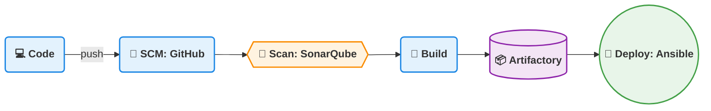


# Tools used in CI/CD

1. Jenkins Pipeline

2. Azure DevOps Pipeline

3. GitHub Actions


## Jenkins

Jenkins is an open-source CI/CD automation tool written in Java.

It is used to automate:

- Build

- Test

- Integration

- Deployment

Jenkins integrates with different Version Control Systems and DevOps tools through plugins.

## Jenkins Architecture

Jenkins follows a Master–Agent architecture.

Components

# 1. Master Node

Responsible for:

- Job scheduling

- Configuration management

- Plugin management

- UI interface

# 2. Agent Nodes (Workers)

Responsible for:

- Executing build jobs

- Running deployment tasks

Agents can run on different environments:

- Ubuntu

- RedHat

- CentOS

- Windows

## Jenkins Architecture

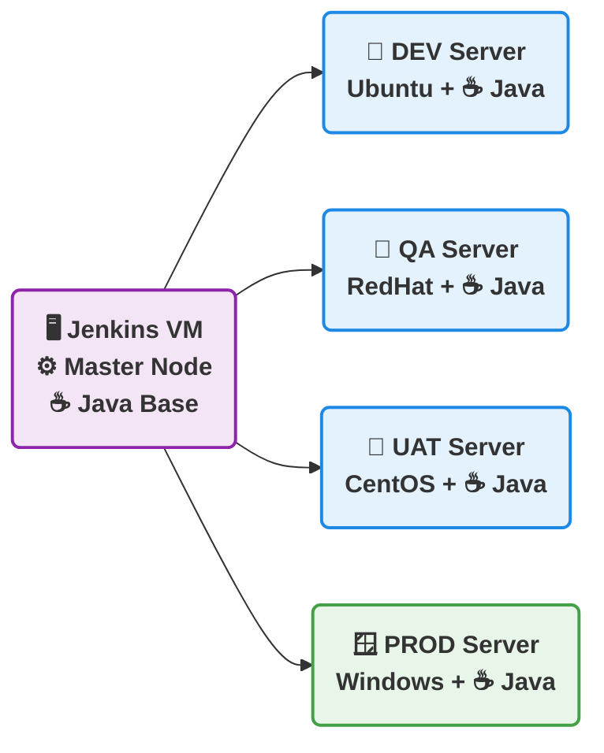

## Jenkins Job Types

There are two types of Jenkins jobs:

1. Freestyle Job

2. Pipeline Project

3. Freestyle Job

A traditional Jenkins job configured through the Jenkins Web UI.

Characteristics:

Simple configuration

No coding required

Used for small automation tasks

Freestyle Build Triggers

Developers push code to the repository.

Jenkins periodically checks for updates using cron scheduling.

---

## Cron Jobs

A cron job is a time-based scheduler in Unix/Linux systems used to run scripts at fixed intervals.

| Cron Expression | Meaning      |
| --------------- | ------------ |
| `* * * * *`     | Every minute |
| `0 * * * *`     | Every hour   |
| `0 0 * * *`     | Daily        |

Uses:

- Nightly builds

- Daily reports

- Scheduled CI builds

## Jenkins Pipeline

A pipeline defines the entire CI/CD workflow as code.

It is written inside a file called: Jenkinsfile

Benefits:

- Pipeline as Code

- Version controlled

- Easier automation

Types of Jenkins Pipelines

1. Scripted Pipeline

2. Declarative Pipeline

# 1. Scripted Pipeline

A Groovy-based pipeline with flexible programming logic.

node {

    stage('Build') {
        echo 'Building...'
    }

    stage('Test') {
        echo 'Testing...'
    }

    if (currentBuild.result == 'SUCCESS') {
        echo 'Build Succeeded'
    } else {
        echo 'Build Failed'
    }

}

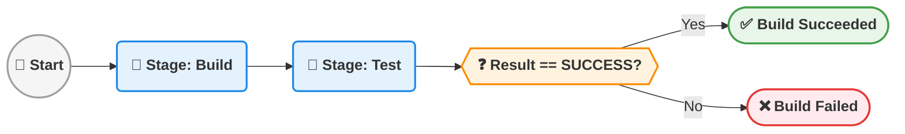

# 2. Declarative Pipeline

A structured and easier-to-read pipeline syntax.

Uses predefined blocks such as:

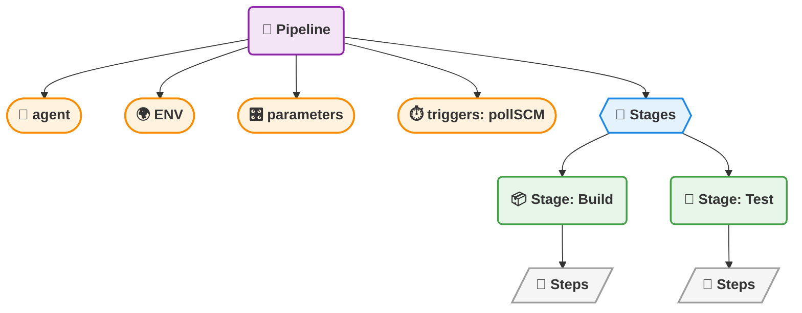

```grovy
pipeline {

    agent {
        label 'JAVA'
    }

    triggers {
        pollSCM('* * * * *')
    }

    stages {

        stage('Build') {
            steps {
                sh 'mvn package'
            }
        }

        stage('Test') {
            steps {
                sh 'mvn test'
            }
        }

    }
}
```

## Basic Jenkins Declarative Pipeline Example

```grovy
pipeline {

    agent { label 'JAVA' }

    stages {

        stage('Git Checkout') {
            steps {
                git url: 'git-tool-link', branch: 'main'
            }
        }

        stage('Build') {
            steps {
                sh 'mvn package'
            }
        }

    }

}
```

## Jenkins Installation

On Master Node

sudo apt update
sudo apt install openjdk-21-jdk -y
sudo apt install jenkins -y

On Worker Node
Install Maven:

sudo apt update
sudo apt install maven -y
mvn --version

## Jenkins Pipeline Execution

Steps:

1. Login to Jenkins Dashboard

2. Click New Item

3. Select Pipeline

4. Configure the pipeline

5. Add Jenkinsfile

6. Click Build Now

## SonarQube

- SonarQube is an open-source code quality and security analysis tool.

- It scans application source code to detect:
  - Bugs

  - Security vulnerabilities

  - Code smells

  - Technical debt

Why Use SonarQube
It helps check the overall code health before deployment.

SonarQube Key Features

## 1. Security

- Detects vulnerabilities like:
  - SQL Injection

  - Hardcoded credentials

  - XSS vulnerabilities

## 2. Reliability

- Identifies bugs that may cause application failures.

- Ensures stable production applications.

## 3. Maintainability

    * Detects:

    * Code smells

    * Technical debt

- Helps keep code:
  - Clean

  - Readable

  - Easy to modify

## 4. Security Hotspots

- Flags sensitive areas such as:
  - Encryption

  - Authentication
  - Authorization

- Requires manual developer review.

## 5. Dependency Risks

- Scans third-party libraries for known vulnerabilities.

- Prevents insecure packages from entering production.

## 6. Code Coverage

- Shows how much code is covered by unit tests.
- Encourages better testing practices.
- Example: **80% coverage threshold** for a quality gate.

## 7. Code Duplication

- Detects duplicated code blocks.
- Helps reduce redundancy.
- Improves code maintainability.

---

# SonarQube

**SonarQube** is a **static code analysis tool** used to ensure code quality by analyzing source code and identifying potential issues.

It checks for:

- Vulnerabilities
- Reliability issues
- Maintainability problems
- Code coverage
- Code duplications
- Dependency risks
- Security hotspots

SonarQube helps enforce **quality gates in CI/CD pipelines** before deployment.

---

# Types of Code Coverage in SonarQube

1. Line Coverage
2. Branch Coverage
3. Overall Coverage

---

## 1. Line Coverage

- Shows the **percentage of lines of code executed by automated tests**.
- Verifies whether each line of code is executed by at least one test.
- Helps identify **untested lines of code**.
- Displayed according to **project folder or package structure**.

### Example

If a project has **100 lines of code** and tests execute **80 lines**:

```
Line Coverage = 80%
```

---

## 2. Branch Coverage

- Measures how many **decision paths** are tested in the code.

Examples of decision paths:

- `if / else`
- `switch` cases
- Ternary operators
- Logical conditions

Branch coverage is displayed according to the **project structure**, allowing developers to view coverage by:

- Module
- Package
- Class
- File

### Example

If a condition contains **4 branches** and tests cover **2 branches**:

```
Branch Coverage = 50%
```

---

## 3. Overall Coverage

- A **combined measurement** of:
  - Line Coverage
  - Branch Coverage
- Represents the **total percentage of code covered by tests across the entire project**.

---

## Summary

| Coverage Type    | Description                                 |
| ---------------- | ------------------------------------------- |
| Line Coverage    | Percentage of code lines executed by tests  |
| Branch Coverage  | Percentage of decision paths tested         |
| Overall Coverage | Combined metric of line and branch coverage |

---

# SonarQube / SonarCloud Integration with Jenkins CI/CD Pipeline

## CI/CD Pipeline with SonarQube

In our CI/CD pipeline, after code is pushed:

- **SonarQube performs static code analysis** and checks the **Quality Gate** (configured at **85%**).
- If the result is **below 85%**, the **pipeline fails** and the code is sent back to developers for improvement.
- Once the **Quality Gate passes**, the **build stage is triggered** and the application proceeds further in the pipeline.

---

# How to Install SonarQube

There are **three ways** to install SonarQube:

1. By using **CLI (SonarScanner)** to install SonarQube
2. **SonarCloud** – 30 days free trial
3. Using **Docker**

---

# How to Set Up SonarCloud

### Step 1: Create an Account

- Sign up using **GitHub**

### Step 2: Create an Organization

- Create a **new organization** inside SonarCloud.

### Step 3: Create a Project

- Create a **project inside the chosen repository**.

---

# How to Integrate Jenkins with SonarQube / SonarCloud

## Step 1: Install Plugins

- Install the **SonarQube Plugin** in Jenkins.

## Step 2: Configure Jenkins with SonarQube

- Connect **Jenkins to SonarQube / SonarCloud**.

### Flow

```
Jenkins → Execute SonarQube
```

---

# SonarCloud – New Code Period

In **SonarCloud**, the **New Code Period** can be configured in two ways:

### 1. Previous Version

If it is set to **Previous Version**:

- SonarCloud compares the **current build with the last baseline**.
- Only the **newly changed code** is analyzed.

### 2. Number of Days

If it is set to **Number of Days** (example: **30 days**):

- Only code **modified in the last 30 days** is considered as **new code**.
- Quality Gate conditions apply only to this new code.
- This helps teams focus on **recent changes instead of legacy issues**.

---

# Implementing Jenkins Pipeline with SonarCloud

## 1. Infrastructure Setup

Create the following nodes:

- **1 Master Node**
- **1 Worker Node**

---

## 2. Master Node Setup

Update system packages:

```bash
sudo apt update
```

Install Java:

```bash
sudo apt install openjdk-21-jdk -y
```

Install **Jenkins** using the **official Jenkins documentation**.

---

## 3. Worker Node Setup

Update packages:

```bash
sudo apt update
```

Install Java:

```bash
sudo apt install openjdk-21-jdk -y
```

---

## 4. Access Jenkins

Open Jenkins in your browser:

```
http://<public-ip>:8080
```

(Master Node Public IP)

---

## 5. Get Jenkins Initial Password

Run the following command on the **Master Node**:

```bash
sudo cat /var/lib/jenkins/secrets/initialAdminPassword
```

Example Output:

```
*****
```

Enter this password in the Jenkins setup page.

---

## 6. Install Jenkins Plugins

- Click **Install Suggested Plugins**.
- Jenkins will automatically download and install the required plugins.

---

## 7. Configure Jenkins Credentials

Provide appropriate **admin credentials** to complete the setup.

---

## 8. Create a Worker Node (Agent)

Go to:

```
Manage Jenkins → Nodes → New Node
```

---

## 9. Node Configuration

Provide the following details:

### Remote Root Directory

```
/home/ubuntu/<any-name>
```

### Labels

Add a label for the worker node.

### Launch Method

Select:

```
Launch agent via SSH
```

Provide the following details:

- **Host** → Worker Node Private IP
- **Credentials** → Add new SSH credentials

Click **Save**.

---

## 10. Verify Agent Connection

- Go to the **Node page**
- Click **Logs**

If the **Agent status is Online**, it means the **Master Node and Worker Node are successfully connected**.

---

## 11. Create a Jenkins Pipeline

1. Click **New Item**
2. Select **Pipeline**
3. Click **OK**

---

## 12. Configure Source Code Management

Write the pipeline using **SCM (Git Repository)**.

Example:

```
GitHub Repository
```

---

## 13. Install SonarQube Scanner Plugin

Go to:

```
Manage Jenkins
→ Manage Plugins
→ Available Plugins
→ SonarQube Scanner
```

Install the plugin.

---

## 14. Restart Jenkins

After the plugin installation:

- Restart Jenkins using the **available restart option**.

---

# Summary

| Component              | Purpose                            |
| ---------------------- | ---------------------------------- |
| Jenkins                | CI/CD automation tool              |
| SonarQube / SonarCloud | Static code analysis               |
| Quality Gate           | Ensures minimum code quality (85%) |
| Master Node            | Jenkins controller                 |
| Worker Node            | Executes pipeline tasks            |

---

# Jenkins Pipeline with SonarCloud

This Jenkins pipeline performs the following tasks:

- Polls the Git repository for changes
- Checks out the source code from GitHub
- Builds the application using Maven
- Runs **SonarCloud static code analysis**

---

## Pipeline Workflow

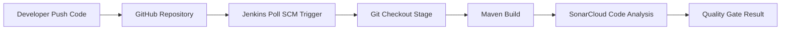

---

## Jenkins Pipeline Code

```groovy
pipeline {
    agent {label 'SPC'}

    triggers {
        pollSCM('* * * * *')
    }

    stages {

        stage ('git checkout') {
            steps {
                git url: 'https://github.com/maratinikhil/spring-petclinic.git',
                    branch: 'main'
            }
        }

        stage ('build & scan') {
            steps {
                withCredentials([string(credentialsId: 'SONAR', variable: 'SONAR_TOKEN')]) {

                    withSonarQubeEnv('SONAR') {

                        sh """mvn package sonar:sonar \
                        -Dsonar.projectkey=maratinikhil_spring-petclinic \
                        -Dsonar.organization=maratinikhil \
                        -Dsonar.host.url=https://sonarcloud.io \
                        -Dsonar.login=$SONAR_TOKEN
                        """

                    }

                }
            }
        }

    }
}
```

---

# Sending Test Reports to DevOps Engineers using Jenkins Archive

This Jenkins pipeline demonstrates how to **store build artifacts and test reports** so that **DevOps engineers in the organization can access them from Jenkins**.

### What happens in this pipeline

- Jenkins polls the GitHub repository for changes
- Source code is checked out
- Maven builds the application and runs tests
- SonarCloud performs static code analysis
- Jenkins archives:
  - Build artifacts (`.jar`)
  - Test reports (`surefire-reports`)
- DevOps engineers can view the reports from the **Jenkins UI**

---

## Test Report and Artifact Flow

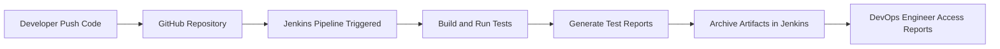

---

## Jenkins Pipeline Code

```groovy
pipeline {
    agent {label 'SPC'}

    triggers {
        pollSCM('* * * * *')
    }

    stages {

        stage ('git checkout') {
            steps {
                git url: 'https://github.com/maratinikhil/spring-petclinic.git',
                    branch: 'main'
            }
        }

        stage ('build & scan') {
            steps {
                withCredentials([string(credentialsId: 'sonar_id', variable: 'SONAR_TOKEN')]){
                    withSonarQubeEnv('SONAR'){
                        sh """mvn package sonar:sonar \
                        -Dsonar.projectKey=maratinikhil_spring-petclinic \
                        -Dsonar.organization=maratinikhil \
                        -Dsonar.host.url=https://sonarcloud.io/ \
                        -Dsonar.login=$SONAR_TOKEN
                        """
                    }
                }
            }
        }

    }

    post {

        always {
            archiveArtifacts artifacts: '**/target/*.jar', fingerprint: true
            archiveArtifacts artifacts: 'target/surefire-reports/*.xml'
            junit '**/target/surefire-reports/*.xml'
        }

        success {
            echo 'pipeline executed successfully!'
        }

        failure {
            echo 'pipeline failed. check the logs for details'
        }

    }
}
```

---

## Archived Artifacts

| Artifact                 | Purpose                                    |
| ------------------------ | ------------------------------------------ |
| `target/*.jar`           | Built application package                  |
| `surefire-reports/*.xml` | Test execution reports                     |
| JUnit Reports            | Displays test results in Jenkins dashboard |

DevOps engineers can download these artifacts directly from the **Jenkins build artifacts section**.

---

# JFrog Artifactory

## Artifactory

**Artifactory** is a centralized **binary repository and artifact lifecycle management platform** used to store and manage build outputs and third-party dependencies.

It integrates with **CI/CD pipelines** to enable:

- Dependency caching
- Artifact promotion
- Security scanning
- End-to-end traceability across the software delivery lifecycle

---

## JFrog Artifactory

**JFrog Artifactory** is a **binary repository manager** used to store, manage, and version control build artifacts and software dependencies generated during the software development process.

It acts as a **central storage system** for:

- Application binaries (**JAR, WAR, ZIP**)
- Third-party libraries
- Docker images

Artifactory integrates with **CI/CD tools like Jenkins** to support automated builds and deployments.

---

## Artifactory in CI/CD Pipeline

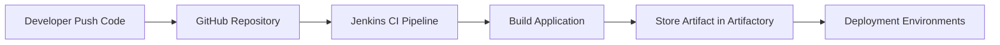

---

# Types of Repositories in JFrog Artifactory

JFrog Artifactory mainly supports **three types of repositories**.

---

## 1. Local Repository

A **Local Repository** is used to store artifacts that are **built and published internally** by the organization.

### Characteristics

- Stores **internally built artifacts**
- Used for **project build outputs**
- Supports versioning of artifacts

### Examples

- JAR files
- WAR files
- Docker images
- ZIP packages

---

## 2. Remote Repository

A **Remote Repository** acts as a **proxy/cache** for external public repositories.

### Characteristics

- Downloads artifacts from external repositories
- Caches them locally
- Improves build speed and reliability

### Examples

Artifacts pulled from:

- **Maven Central**
- **npm registry**
- **Docker Hub**

---

## 3. Virtual Repository

A **Virtual Repository** is a **logical collection of multiple repositories**.

It combines:

- Local repositories
- Remote repositories

and exposes them through **a single unified URL**.

### Benefits

- Simplifies dependency management
- Provides a single endpoint for developers
- Improves repository organization

---

## Repository Structure Diagram

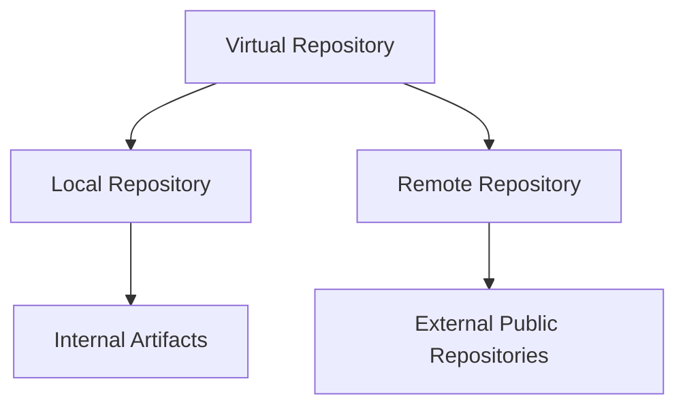

---

# Summary

| Repository Type    | Description                                          |
| ------------------ | ---------------------------------------------------- |
| Local Repository   | Stores internally built artifacts                    |
| Remote Repository  | Proxy for external repositories                      |
| Virtual Repository | Combines multiple repositories into one access point |

---

# Jenkins Integration with JFrog Artifactory

This section explains how to **upload build artifacts from Jenkins to JFrog Artifactory** using the **JFrog and Artifactory plugins** in Jenkins.

Before running the pipeline, install the following plugins in the **Jenkins Dashboard**:

- JFrog Plugin
- Artifactory Plugin

These plugins allow Jenkins pipelines to **publish artifacts directly to JFrog Artifactory repositories**.

---

# CI/CD Flow with Artifactory

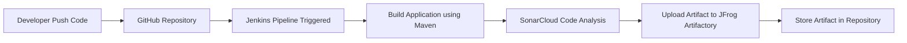

---

# Jenkins Pipeline with JFrog Artifactory

```groovy
pipeline {
    agent {label 'SPC'}

    triggers {
        pollSCM('* * * * *')
    }

    stages {

        stage ('git checkout') {
            steps {
                git url: 'https://github.com/maratinikhil/spring-petclinic.git',
                    branch: 'main'
            }
        }

        stage ('build & scan') {
            steps {
                withCredentials([string(credentialsId: 'sonar_id', variable: 'SONAR_TOKEN')]){
                    withSonarQubeEnv('SONAR'){
                        sh """mvn package sonar:sonar \
                        -Dsonar.projectKey=maratinikhil_spring-petclinic \
                        -Dsonar.organization=maratinikhil \
                        -Dsonar.host.url=https://sonarcloud.io/ \
                        -Dsonar.login=$SONAR_TOKEN
                        """
                    }
                }
            }
        }

        stage ('Artifactory - Jfrog'){
            steps {
                rtUpload (
                    serverId: 'Jfrog',
                    spec: '''{
                        "files": [
                            {
                                "pattern": "target/*.jar",
                                "target": "spcjava-spc/"
                            }
                        ]
                    }'''
                )

                rtPublishBuildInfo(serverId: 'Jfrog')
            }
        }
    }

    post {

        always {
            archiveArtifacts artifacts: '**/target/*.jar', fingerprint: true
            archiveArtifacts artifacts: 'target/surefire-reports/*.xml'
            junit '**/target/surefire-reports/*.xml'
        }

        success {
            echo 'pipeline executed successfully!'
        }

        failure {
            echo 'pipeline failed. check the logs for details'
        }

    }
}
```

---

# Fixing Pipeline Failure (JFrog Authentication Setup)

If the pipeline fails during **Artifactory upload**, follow these steps.

### Step 1: Generate JFrog Token

1. Login to **JFrog Artifactory**
2. Click **Edit Profile**
3. Generate a **new token**
4. Copy the generated token

---

### Step 2: Get Encrypted Password

1. Enter your **JFrog password**
2. Click **Unlock**
3. Scroll down and copy the **Encrypted Password**

---

### Step 3: Add Credentials in Jenkins

1. Go to **Jenkins Dashboard**
2. Navigate to:

```
Manage Jenkins → Credentials → Add Credentials
```

3. Select:

```
Username with Password
```

4. Provide the following details:

- **Username** → JFrog Username
- **Password** → Encrypted Password
- **Secret Key** → Generated Token
- **Description** → JFrog Credentials

5. Click **Save**

---

### Step 4: Run the Pipeline

After adding the credentials:

- Run the **Jenkins pipeline again**
- The pipeline will **upload artifacts successfully to JFrog Artifactory**

---

# Artifact Storage

Artifacts uploaded from Jenkins:

| Artifact       | Location                     |
| -------------- | ---------------------------- |
| `.jar` file    | JFrog Artifactory repository |
| Test reports   | Jenkins artifacts section    |
| Build metadata | JFrog Build Info             |

---

# Jenkins Pipeline with Parameters

This section demonstrates how to implement **parameters in a Jenkins Pipeline**.  
Using parameters allows users to **choose different Maven goals at runtime** when triggering the pipeline.

In this example, the user can select one of the following Maven goals:

- `package`
- `clean install`
- `verify`

The selected value is passed dynamically to the Maven command in the pipeline.

---

# Parameterized CI/CD Pipeline Flow

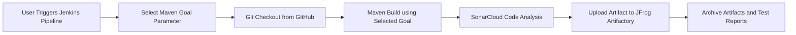

---

# Jenkins Pipeline Code (Parameterized)

```groovy
pipeline {
    agent {label 'SPC'}

    triggers {
        pollSCM('* * * * *')
    }

    parameters {
        choice(
            name: 'CHOICE',
            choices: ['package', 'clean install', 'verify'],
            description: 'Select Maven goal'
        )
    }

    stages {

        stage ('git checkout') {
            steps {
                git url: 'https://github.com/maratinikhil/spring-petclinic.git',
                    branch: 'main'
            }
        }

        stage ('build & scan') {
            steps {
                withCredentials([string(credentialsId: 'sonar_id', variable: 'SONAR_TOKEN')]){

                    withSonarQubeEnv('SONAR'){

                        sh """mvn ${params.CHOICE} sonar:sonar \
                        -Dsonar.projectKey=maratinikhil_spring-petclinic \
                        -Dsonar.organization=maratinikhil \
                        -Dsonar.host.url=https://sonarcloud.io/ \
                        -Dsonar.login=$SONAR_TOKEN
                        """

                    }

                }
            }
        }

        stage ('Artifactory - Jfrog'){
            steps {

                rtUpload (
                    serverId: 'Jfrog',
                    spec: '''{
                        "files": [
                            {
                                "pattern": "target/*.jar",
                                "target": "spcjava-spc/"
                            }
                        ]
                    }'''
                )

                rtPublishBuildInfo(serverId: 'Jfrog')

            }
        }

    }

    post {

        always {
            archiveArtifacts artifacts: '**/target/*.jar', fingerprint: true
            archiveArtifacts artifacts: 'target/surefire-reports/*.xml'
            junit '**/target/surefire-reports/*.xml'
        }

        success {
            echo 'pipeline executed successfully!'
        }

        failure {
            echo 'pipeline failed. check the logs for details'
        }

    }
}
```

---

# How Parameters Work

When the pipeline is triggered:

1. Jenkins prompts the user to **select a Maven goal**.
2. The selected option is stored in the variable:

```
params.CHOICE
```

3. The pipeline executes the Maven command dynamically:

```
mvn ${params.CHOICE}
```

Example execution:

| Selected Parameter | Maven Command Executed |
| ------------------ | ---------------------- |
| package            | `mvn package`          |
| clean install      | `mvn clean install`    |
| verify             | `mvn verify`           |

---

# Benefits of Using Parameters

- Allows **dynamic pipeline execution**
- Provides **flexibility for different build goals**
- Reduces the need for multiple pipelines
- Improves **CI/CD pipeline customization**

---

# Jenkins Pipeline Implementation using Python

This section demonstrates how to implement a **Jenkins CI/CD pipeline for a Python project** using a **Master–Worker architecture**.

The pipeline performs the following tasks:

- Jenkins polls the GitHub repository for changes
- Checks out the Python project
- Creates a Python virtual environment
- Installs project dependencies

---

# Infrastructure Setup

To implement this pipeline, create the following infrastructure:

1. Create **2 EC2 Instances**
   - **Master Node** – Jenkins Controller
   - **Worker Node** – Executes the pipeline

2. In the **Master Node**
   - Install **Java 21**
   - Install **Jenkins**

3. In the **Worker Node**
   - Install **Java 21**
   - Install **Maven**

4. Install Python virtual environment package:

```bash
sudo apt install python3.12-venv -y
```

5. Clone the project from GitHub.

6. Navigate to the project directory.

---

# Python CI/CD Pipeline Flow

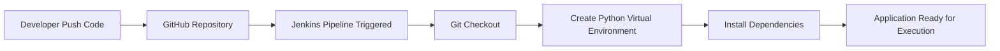

---

# Jenkins Pipeline Code

Create a **Jenkinsfile** inside the project repository.

```groovy
pipeline{
    agent {label "Python-Sample-Project"}

    triggers {
        pollSCM('* * * * *')
    }

    stages {

        stage ("git checkout") {
            steps {
                git url: "https://github.com/maratinikhil/Auth-py-django.git",
                    branch: "main"
            }
        }

        stage ("installing dependencies"){
            steps {
                sh """
                python3 -m venv venv
                . venv/bin/activate
                pip install -r requirements.txt
                """
            }
        }

    }
}
```

---

# Pipeline Explanation

| Stage                | Description                                        |
| -------------------- | -------------------------------------------------- |
| Git Checkout         | Retrieves the Python project from GitHub           |
| Virtual Environment  | Creates an isolated Python environment             |
| Install Dependencies | Installs required packages from `requirements.txt` |

---

# Tools Used

| Tool                | Purpose                       |
| ------------------- | ----------------------------- |
| Jenkins             | CI/CD automation              |
| GitHub              | Source code repository        |
| Python              | Application runtime           |
| pip                 | Python dependency manager     |
| Virtual Environment | Isolates project dependencies |

---

[def]: #2-master-node-setup
