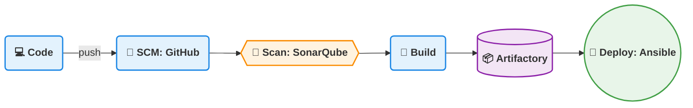
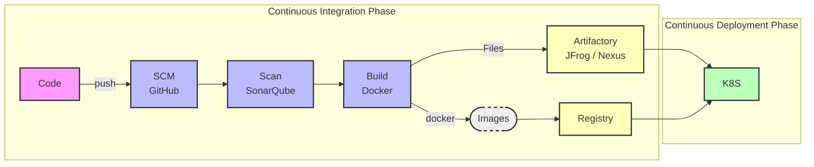
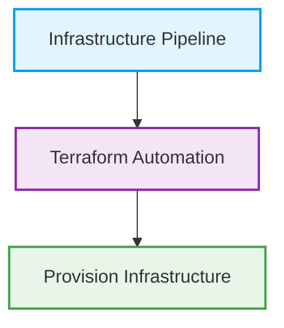
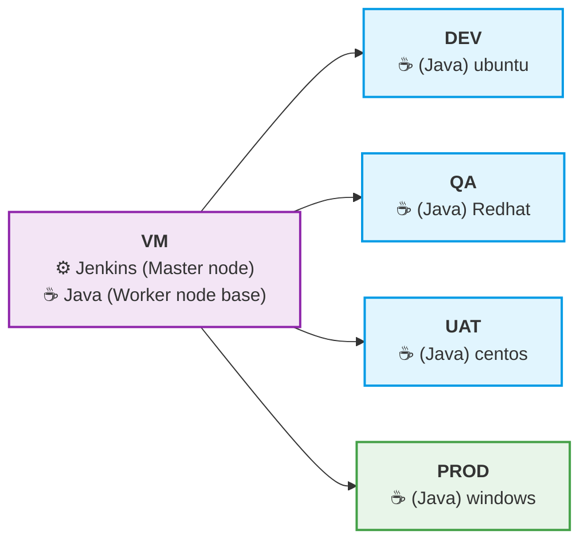
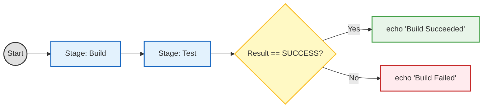
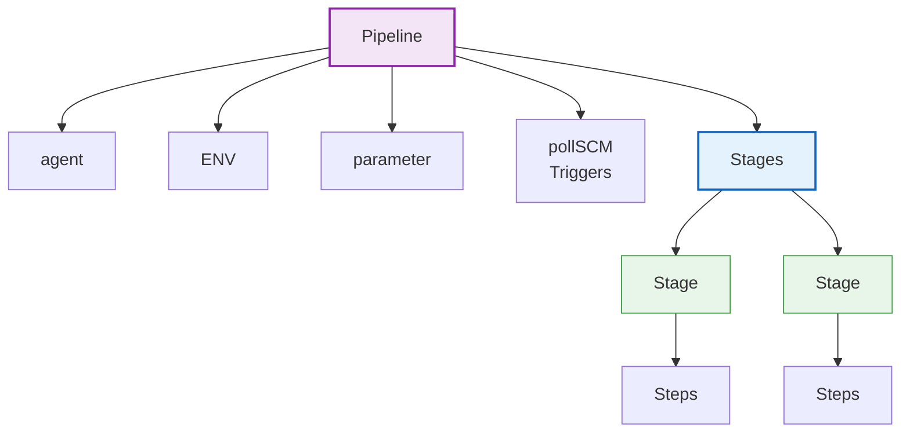

# Pipeline-Documentation

Pipeline

DevOps CI/CD & Jenkins Notes
Software Development Life Cycle (SDLC)

SDLC defines the process used to develop software efficiently and systematically.

Stages of SDLC

1. Planning

2. Designing

3. Development

4. Testing

5. Deployment

6. Support / Maintenance

| Stage       | Responsible Team          |
| ----------- | ------------------------- |
| Planning    | Management / Product Team |
| Designing   | Architecture Team         |
| Development | Developers                |
| Testing     | QA / Testers              |
| Deployment  | DevOps                    |
| Support     | Maintenance Team          |

CI/CD Pipeline Overview

Typical CI/CD pipeline flow:





Tools used in CI/CD

1. Jenkins Pipeline

2. Azure DevOps Pipeline

3. GitHub Actions



Jenkins

Jenkins is an open-source CI/CD automation tool written in Java.

It is used to automate:

- Build

- Test

- Integration

- Deployment

Jenkins integrates with different Version Control Systems and DevOps tools through plugins.

Jenkins Architecture

Jenkins follows a Master–Agent architecture.

Components

1. Master Node

Responsible for:

- Job scheduling

- Configuration management

- Plugin management

- UI interface

2. Agent Nodes (Workers)

Responsible for:

- Executing build jobs

- Running deployment tasks

Agents can run on different environments:

- Ubuntu

- RedHat

- CentOS

- Windows

Jenkins Architecture



Jenkins Job Types

There are two types of Jenkins jobs:

1. Freestyle Job

2. Pipeline Project

3. Freestyle Job

A traditional Jenkins job configured through the Jenkins Web UI.

Characteristics:

Simple configuration

No coding required

Used for small automation tasks

Freestyle Build Triggers

Developers push code to the repository.

Jenkins periodically checks for updates using cron scheduling.

---

Cron Jobs

A cron job is a time-based scheduler in Unix/Linux systems used to run scripts at fixed intervals.

| Cron Expression | Meaning      |
| --------------- | ------------ |
| `* * * * *`     | Every minute |
| `0 * * * *`     | Every hour   |
| `0 0 * * *`     | Daily        |

Uses:

- Nightly builds

- Daily reports

- Scheduled CI builds

Jenkins Pipeline

A pipeline defines the entire CI/CD workflow as code.

It is written inside a file called: Jenkinsfile

Benefits:

* Pipeline as Code

* Version controlled

* Easier automation

Types of Jenkins Pipelines

1. Scripted Pipeline

2. Declarative Pipeline

1. Scripted Pipeline

A Groovy-based pipeline with flexible programming logic.

node {

    stage('Build') {
        echo 'Building...'
    }

    stage('Test') {
        echo 'Testing...'
    }

    if (currentBuild.result == 'SUCCESS') {
        echo 'Build Succeeded'
    } else {
        echo 'Build Failed'
    }

}




2. Declarative Pipeline

A structured and easier-to-read pipeline syntax.

Uses predefined blocks such as:



```grovy
pipeline {

    agent {
        label 'JAVA'
    }

    triggers {
        pollSCM('* * * * *')
    }

    stages {

        stage('Build') {
            steps {
                sh 'mvn package'
            }
        }

        stage('Test') {
            steps {
                sh 'mvn test'
            }
        }

    }
}
```


Basic Jenkins Declarative Pipeline Example
```grovy
pipeline {

    agent { label 'JAVA' }

    stages {

        stage('Git Checkout') {
            steps {
                git url: 'git-tool-link', branch: 'main'
            }
        }

        stage('Build') {
            steps {
                sh 'mvn package'
            }
        }

    }

}
```

Jenkins Installation
On Master Node

sudo apt update
sudo apt install openjdk-21-jdk -y
sudo apt install jenkins -y

On Worker Node
Install Maven:

sudo apt update
sudo apt install maven -y
mvn --version

Jenkins Pipeline Execution

Steps:

1. Login to Jenkins Dashboard

2. Click New Item

3. Select Pipeline

4. Configure the pipeline

5. Add Jenkinsfile

6. Click Build Now


SonarQube

SonarQube is an open-source code quality and security analysis tool.

It scans application source code to detect:

* Bugs

* Security vulnerabilities

* Code smells

* Technical debt

Why Use SonarQube
It helps check the overall code health before deployment.

SonarQube Key Features

1. Security

Detects vulnerabilities like:

* SQL Injection

* Hardcoded credentials

* XSS vulnerabilities

2. Reliability

Identifies bugs that may cause application failures.

Ensures stable production applications.

3. Maintainability

* Detects:

* Code smells

* Technical debt

Helps keep code:

* Clean

* Readable

* Easy to modify

4. Security Hotspots

Flags sensitive areas such as:

* Encryption

* Authentication
  
* Authorization

Requires manual developer review.

5. Dependency Risks

Scans third-party libraries for known vulnerabilities.

Prevents insecure packages from entering production.