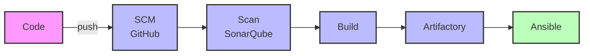
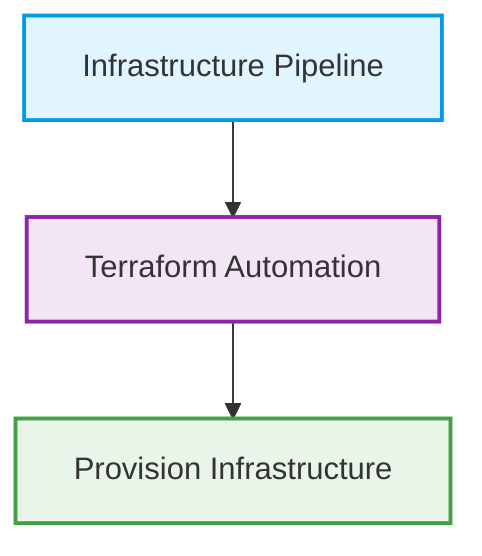
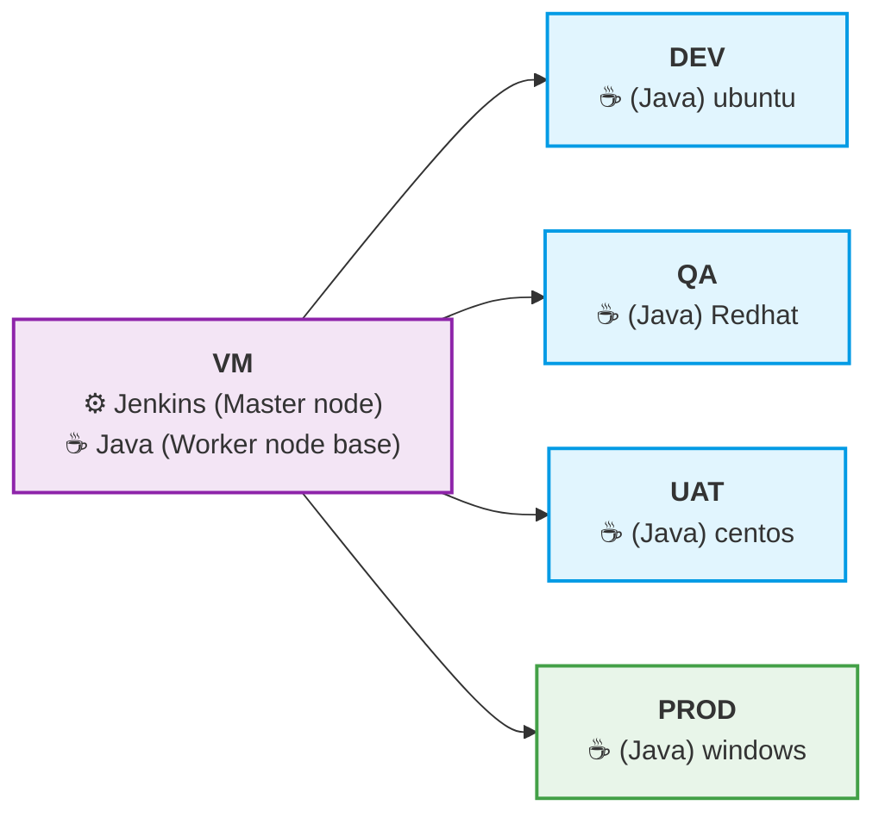

# Pipeline-Documentation
Pipeline 

DevOps CI/CD & Jenkins Notes
Software Development Life Cycle (SDLC)

SDLC defines the process used to develop software efficiently and systematically.

Stages of SDLC

1. Planning

2. Designing

3. Development

4. Testing

5. Deployment

6. Support / Maintenance

| Stage       | Responsible Team          |
| ----------- | ------------------------- |
| Planning    | Management / Product Team |
| Designing   | Architecture Team         |
| Development | Developers                |
| Testing     | QA / Testers              |
| Deployment  | DevOps                    |
| Support     | Maintenance Team          |

CI/CD Pipeline Overview

Typical CI/CD pipeline flow:

graph LR
    subgraph CI [Continuous Integration Phase]
        A[Code] -- push --> B[SCM GitHub]
        B --> C[Scan SonarQube]
        C --> D[Build Docker]
        
        D -- Files --> E[Artifactory JFrog / Nexus]
        D -- docker --> F([Images])
        
        F --> G[Registry]
    end
    
    subgraph CD [Continuous Deployment Phase]
        E --> H[K8S]
        G --> H
    end
    
    %% Styling
    style A fill:#f9f,stroke:#333,stroke-width:2px
    style B fill:#bbf,stroke:#333,stroke-width:2px
    style C fill:#bbf,stroke:#333,stroke-width:2px
    style D fill:#bbf,stroke:#333,stroke-width:2px
    style E fill:#ffb,stroke:#333,stroke-width:2px
    style F fill:#eee,stroke:#333,stroke-width:2px,stroke-dasharray: 5 5
    style G fill:#ffb,stroke:#333,stroke-width:2px
    style H fill:#bfb,stroke:#333,stroke-width:2px

Tools used in CI/CD

1. Jenkins Pipeline

2. Azure DevOps Pipeline

3. GitHub Actions

Jenkins

Jenkins is an open-source CI/CD automation tool written in Java.

It is used to automate:

* Build

* Test

* Integration

* Deployment

Jenkins integrates with different Version Control Systems and DevOps tools through plugins.

Jenkins Architecture

Jenkins follows a Master–Agent architecture.

Components

1. Master Node

Responsible for:

* Job scheduling

* Configuration management

* Plugin management

* UI interface

2. Agent Nodes (Workers)

Responsible for:

* Executing build jobs

* Running deployment tasks

Agents can run on different environments:

* Ubuntu

* RedHat

* CentOS

* Windows

Jenkins Architecture

