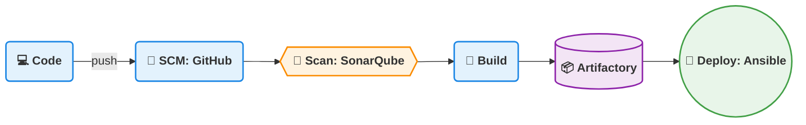
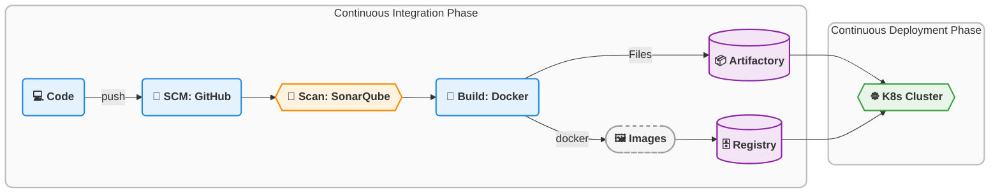
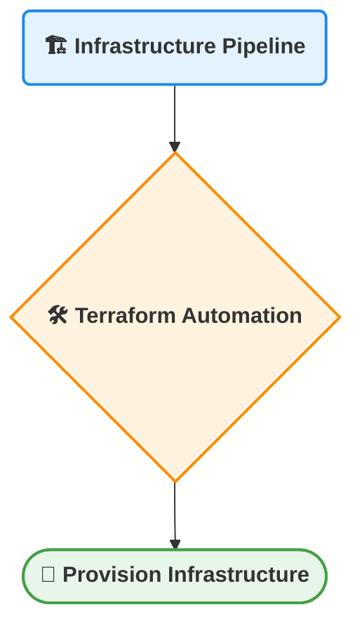
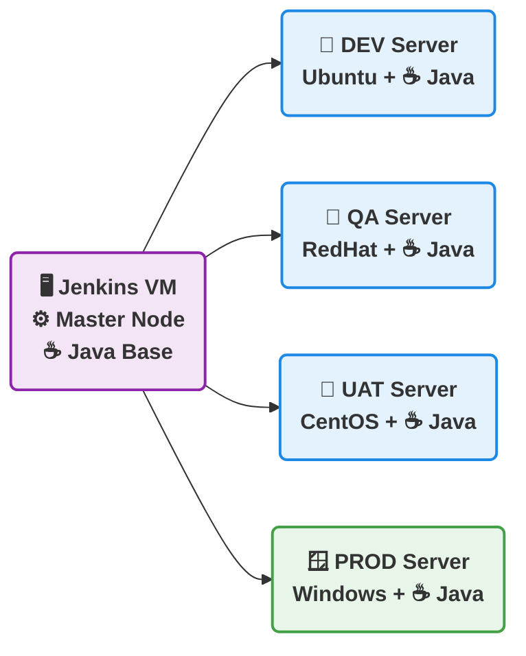

# Pipeline-Documentation

# Pipeline

## Table of Contents

- [Pipeline-Documentation](#pipeline-documentation)
- [Pipeline](#pipeline)
  - [Table of Contents](#table-of-contents)
  - [DevOps CI/CD \& Jenkins Notes](#devops-cicd--jenkins-notes)
- [Software Development Life Cycle (SDLC)](#software-development-life-cycle-sdlc)
  - [Stages of SDLC](#stages-of-sdlc)
- [CI/CD Pipeline Overview](#cicd-pipeline-overview)
- [Tools used in CI/CD](#tools-used-in-cicd)
  - [Jenkins](#jenkins)
  - [Jenkins Architecture](#jenkins-architecture)
- [1. Master Node](#1-master-node)
- [2. Agent Nodes (Workers)](#2-agent-nodes-workers)
  - [Jenkins Architecture](#jenkins-architecture-1)
  - [Jenkins Job Types](#jenkins-job-types)
  - [Cron Jobs](#cron-jobs)
  - [Jenkins Pipeline](#jenkins-pipeline)
- [1. Scripted Pipeline](#1-scripted-pipeline)
- [2. Declarative Pipeline](#2-declarative-pipeline)
  - [Basic Jenkins Declarative Pipeline Example](#basic-jenkins-declarative-pipeline-example)
  - [Jenkins Installation](#jenkins-installation)
  - [Jenkins Pipeline Execution](#jenkins-pipeline-execution)
  - [SonarQube](#sonarqube)
  - [1. Security](#1-security)
  - [2. Reliability](#2-reliability)
  - [3. Maintainability](#3-maintainability)
  - [4. Security Hotspots](#4-security-hotspots)
  - [5. Dependency Risks](#5-dependency-risks)
  - [6.  Code Coverage](#6--code-coverage)
  - [7.  Code Duplication](#7--code-duplication)
- [SonarQube](#sonarqube-1)
- [Types of Code Coverage in SonarQube](#types-of-code-coverage-in-sonarqube)
  - [1. Line Coverage](#1-line-coverage)
    - [Example](#example)
  - [2. Branch Coverage](#2-branch-coverage)
    - [Example](#example-1)
  - [3. Overall Coverage](#3-overall-coverage)
  - [Summary](#summary)

## DevOps CI/CD & Jenkins Notes

# Software Development Life Cycle (SDLC)

SDLC defines the process used to develop software efficiently and systematically.

## Stages of SDLC

1. Planning

2. Designing

3. Development

4. Testing

5. Deployment

6. Support / Maintenance

| Stage       | Responsible Team          |
| ----------- | ------------------------- |
| Planning    | Management / Product Team |
| Designing   | Architecture Team         |
| Development | Developers                |
| Testing     | QA / Testers              |
| Deployment  | DevOps                    |
| Support     | Maintenance Team          |

# CI/CD Pipeline Overview

Typical CI/CD pipeline flow:





# Tools used in CI/CD

1. Jenkins Pipeline

2. Azure DevOps Pipeline

3. GitHub Actions



## Jenkins

Jenkins is an open-source CI/CD automation tool written in Java.

It is used to automate:

- Build

- Test

- Integration

- Deployment

Jenkins integrates with different Version Control Systems and DevOps tools through plugins.

## Jenkins Architecture

Jenkins follows a Master–Agent architecture.

Components

# 1. Master Node

Responsible for:

- Job scheduling

- Configuration management

- Plugin management

- UI interface

# 2. Agent Nodes (Workers)

Responsible for:

- Executing build jobs

- Running deployment tasks

Agents can run on different environments:

- Ubuntu

- RedHat

- CentOS

- Windows

## Jenkins Architecture



## Jenkins Job Types

There are two types of Jenkins jobs:

1. Freestyle Job

2. Pipeline Project

3. Freestyle Job

A traditional Jenkins job configured through the Jenkins Web UI.

Characteristics:

Simple configuration

No coding required

Used for small automation tasks

Freestyle Build Triggers

Developers push code to the repository.

Jenkins periodically checks for updates using cron scheduling.

---

## Cron Jobs

A cron job is a time-based scheduler in Unix/Linux systems used to run scripts at fixed intervals.

| Cron Expression | Meaning      |
| --------------- | ------------ |
| `* * * * *`     | Every minute |
| `0 * * * *`     | Every hour   |
| `0 0 * * *`     | Daily        |

Uses:

- Nightly builds

- Daily reports

- Scheduled CI builds

## Jenkins Pipeline

A pipeline defines the entire CI/CD workflow as code.

It is written inside a file called: Jenkinsfile

Benefits:

* Pipeline as Code

* Version controlled

* Easier automation

Types of Jenkins Pipelines

1. Scripted Pipeline

2. Declarative Pipeline

# 1. Scripted Pipeline

A Groovy-based pipeline with flexible programming logic.

node {

    stage('Build') {
        echo 'Building...'
    }

    stage('Test') {
        echo 'Testing...'
    }

    if (currentBuild.result == 'SUCCESS') {
        echo 'Build Succeeded'
    } else {
        echo 'Build Failed'
    }

}


# 2. Declarative Pipeline

A structured and easier-to-read pipeline syntax.

Uses predefined blocks such as:


```grovy
pipeline {

    agent {
        label 'JAVA'
    }

    triggers {
        pollSCM('* * * * *')
    }

    stages {

        stage('Build') {
            steps {
                sh 'mvn package'
            }
        }

        stage('Test') {
            steps {
                sh 'mvn test'
            }
        }

    }
}
```


## Basic Jenkins Declarative Pipeline Example
```grovy
pipeline {

    agent { label 'JAVA' }

    stages {

        stage('Git Checkout') {
            steps {
                git url: 'git-tool-link', branch: 'main'
            }
        }

        stage('Build') {
            steps {
                sh 'mvn package'
            }
        }

    }

}
```

## Jenkins Installation
On Master Node

sudo apt update
sudo apt install openjdk-21-jdk -y
sudo apt install jenkins -y

On Worker Node
Install Maven:

sudo apt update
sudo apt install maven -y
mvn --version

## Jenkins Pipeline Execution

Steps:

1. Login to Jenkins Dashboard

2. Click New Item

3. Select Pipeline

4. Configure the pipeline

5. Add Jenkinsfile

6. Click Build Now


## SonarQube

- SonarQube is an open-source code quality and security analysis tool.

- It scans application source code to detect:

    * Bugs

    * Security vulnerabilities

    * Code smells

    * Technical debt

Why Use SonarQube
It helps check the overall code health before deployment.

SonarQube Key Features

## 1. Security

- Detects vulnerabilities like:

    * SQL Injection

    * Hardcoded credentials

    * XSS vulnerabilities

## 2. Reliability

- Identifies bugs that may cause application failures.
 
- Ensures stable production applications.

## 3. Maintainability

    * Detects:

    * Code smells

    * Technical debt

- Helps keep code:

    * Clean

    * Readable

    * Easy to modify

## 4. Security Hotspots

- Flags sensitive areas such as:

    * Encryption

    * Authentication
  
    * Authorization

- Requires manual developer review.

## 5. Dependency Risks

- Scans third-party libraries for known vulnerabilities.

- Prevents insecure packages from entering production.

## 6.  Code Coverage
- Shows how much code is covered by unit tests.
- Encourages better testing practices.
- Example: **80% coverage threshold** for a quality gate.

## 7.  Code Duplication
- Detects duplicated code blocks.
- Helps reduce redundancy.
- Improves code maintainability.

---

# SonarQube

**SonarQube** is a **static code analysis tool** used to ensure code quality by analyzing source code and identifying potential issues.

It checks for:

- Vulnerabilities
- Reliability issues
- Maintainability problems
- Code coverage
- Code duplications
- Dependency risks
- Security hotspots

SonarQube helps enforce **quality gates in CI/CD pipelines** before deployment.

---

# Types of Code Coverage in SonarQube

1. Line Coverage  
2. Branch Coverage  
3. Overall Coverage  

---

## 1. Line Coverage

- Shows the **percentage of lines of code executed by automated tests**.
- Verifies whether each line of code is executed by at least one test.
- Helps identify **untested lines of code**.
- Displayed according to **project folder or package structure**.

### Example

If a project has **100 lines of code** and tests execute **80 lines**:

```
Line Coverage = 80%
```

---

## 2. Branch Coverage

- Measures how many **decision paths** are tested in the code.

Examples of decision paths:

- `if / else`
- `switch` cases
- Ternary operators
- Logical conditions

Branch coverage is displayed according to the **project structure**, allowing developers to view coverage by:

- Module
- Package
- Class
- File

### Example

If a condition contains **4 branches** and tests cover **2 branches**:

```
Branch Coverage = 50%
```

---

## 3. Overall Coverage

- A **combined measurement** of:
  - Line Coverage
  - Branch Coverage
- Represents the **total percentage of code covered by tests across the entire project**.

---

## Summary

| Coverage Type | Description |
|---------------|------------|
| Line Coverage | Percentage of code lines executed by tests |
| Branch Coverage | Percentage of decision paths tested |
| Overall Coverage | Combined metric of line and branch coverage |

---